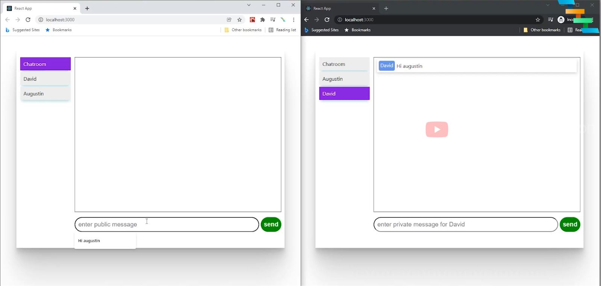

# ChatApplication
A simple Spring boot websocket backend and reactjs client
Added explanations on a code reference 
[ [Github Link](https://github.com/JayaramachandranAugustin/ChatApplication) ]
[ [Tutorial Link](https://youtu.be/o_IjEDAuo8Y) ]

## Roadmap :
    
    + [DONE]    Understand the code reference / add descriptions and notes
    + [Planned] Make a flow chart 
    + [Planned] Edit some parts of code (edit/add websocket endpoints, topic urls, models, controllers, etc)
    + [Planned] Add Redis Queue for messaging (DB as MySql or Postgres)
    + [Planned] Deploy all the above via Docker, ECR, ECS (or K8), Service Registry

## Web Architecture

Server:     Spring Boot 
     Websocket, 
     STOMP Endpoint Registry, 
     Redis as Queue(planned), 
     Postgres(planned)

Client:     ReactJS 
 SockJS -> open WebSocket, 
 STOMP client -> ws endpoint/topics and wrap/unwrap messages

## Web Architecture (planning)
    
    
    

## Infra Architecture (planning)

## ReactJS screen

To start:
    
### Client
        - npm install (in the react-client folder)
        - npm start
    
### Server
        - mvn spring-boot:run (in the spring-ws-server)
